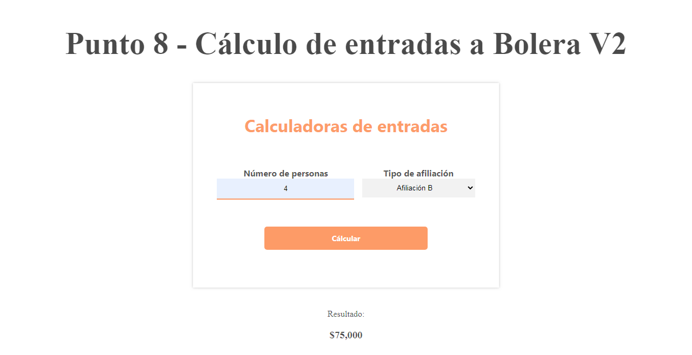

<h1>Taller 10: Karol Cordero</h1>

<h2>Información</h2>

Curso: Full Stack Básico - Grupo 1

Profesor: Crisitina Patiño

<h2>Punto 1:</h2>

<h2>Punto 2:</h2>

<h2>Punto 3:</h2>

<h2>Punto 4:</h2>

<h2>Punto 5:</h2>

<h2>Punto 6:</h2>

<h2>Punto 7:</h2>

<h2>Punto 8:</h2>

<h2>Punto 9:</h2>

<h2>Punto 10:</h2>

<h2>Punto 11:</h2>

<h2>Punto 12:</h2>

<h2>Punto 13:</h2>

<h2>Punto 14:</h2>

<h2>Punto 15:</h2>

